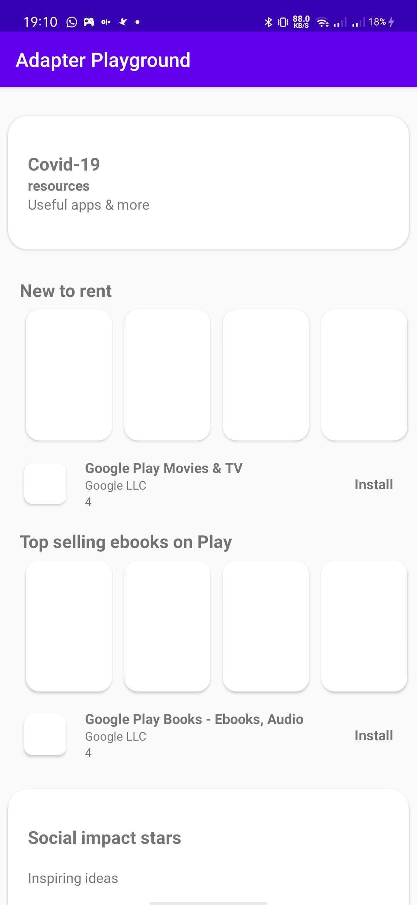

<!--
*** Thanks for checking out this README Template. If you have a suggestion that would
*** make this better, please fork the repo and create a pull request or simply open
*** an issue with the tag "enhancement".
*** Thanks again! Now go create something AMAZING! :D
-->


<!-- PROJECT SHIELDS -->
<!--
*** I'm using markdown "reference style" links for readability.
*** Reference links are enclosed in brackets [ ] instead of parentheses ( ).
*** See the bottom of this document for the declaration of the reference variables
*** for contributors-url, forks-url, etc. This is an optional, concise syntax you may use.
*** https://www.markdownguide.org/basic-syntax/#reference-style-links
-->

<!-- PROJECT LOGO -->
<br />
<p align="center">
  <h3 align="center">Adapter Delegate Playground</h3>

  <p align="center">
    This is a play ground project of implementing adapter delegate in Android.
  </p>
</p>


<!-- TABLE OF CONTENTS -->
## Table of Contents

* [About The Project](#about-the-project)
  * [Built With](#built-with)
* [Contributing](#contributing)
* [License](#license)
* [Contact](#contact)
* [Acknowledgements](#acknowledgements)


<!-- ABOUT THE PROJECT -->
## About The Project

<table>
  <tr>
    <td></td>
    <td></td>
  </tr>
  <tr>
    <td align="center">Playground</td>
    <td align="center">Playstore</td>
  </tr>
 </table>

This project is a playground for anyone who want to try implementing adapter delegate.  Adapter delegate is a technique that help us to create a heterogeneous `RecyclerView`. Instead of using `viewType` and `if else` technique in the adapter and ended creating a God Class, we can try implementing `delegate` technique in order to provide multiple views in a `RecyclerView`. 

>**Favor composition over inheritance**

Now look at this code:

```
class MainAdapter : ListDelegationAdapter<List<DisplayableItem>>(  
    bannerAdapterDelegate(),  
    campaignAdapterDelegate(),  
    featuredAdapterDelegate(),  
    promotionAdapterDelegate()  
)
```

This is an example when we implementing delegate technique in an adapter. As You can see, we can just add and remove the **delegate adapter** to add or remove the view as the requirements of our apps. It will make our adapter more clean and maintainable.

code of adapter delegate:

```
fun bannerAdapterDelegate() = adapterDelegateViewBinding<Banner, DisplayableItem, ItemBannerBinding>(  
    { layoutInflater, root -> ItemBannerBinding.inflate(layoutInflater, root, false) }  
) {  
  bind {  
       // bind your view with your data  
  }  
}
```
using [Adapter Delegate](https://github.com/sockeqwe/AdapterDelegates) library and `ViewBinding` we can create something like that. very clean easy to read. 

>For now this project implementing [Adapter Delegate](https://github.com/sockeqwe/AdapterDelegates) library. But not close the possibility to use code from scratch.

## Built With
* [Kotlin](https://kotlinlang.org/)
* [Androidx](https://developer.android.com/jetpack/androidx)
* [View Binding](https://developer.android.com/topic/libraries/view-binding)
* [Material Design](https://material.io/design/)
* [Adapter Delegate](https://github.com/sockeqwe/AdapterDelegates)

<!-- CONTRIBUTING -->
## Contributing

1. Fork the Project
2. Create your Feature Branch (`git checkout -b feature/AmazingFeature`)
3. Commit your Changes (`git commit -m 'Add some AmazingFeature'`)
4. Push to the Branch (`git push origin feature/AmazingFeature`)
5. Open a Pull Request


<!-- LICENSE -->
## License

Distributed under the MIT License. See `LICENSE` for more information.


<!-- CONTACT -->
## Contact

Anang Kurniawan - [@anang_kur](https://twitter.com/anang_kur) - anang@sampingan.co.id


<!-- ACKNOWLEDGEMENTS -->
## Acknowledgements
* [Keddit — Part 4: RecyclerView — Delegate Adapters & Data Classes with Kotlin](https://android.jlelse.eu/keddit-part-4-recyclerview-delegate-adapters-data-classes-with-kotlin-9248f44327f7)
* [Delegate Adapters: Building Heterogeneous RecyclerView Adapter](https://medium.com/@seidalins/delegate-adapters-building-heterogeneous-recyclerviewadapter-877cb7d3c6c0)
* [Joe's great adapter hell escape](http://hannesdorfmann.com/android/adapter-delegates)

<!-- MARKDOWN LINKS & IMAGES -->
<!-- https://www.markdownguide.org/basic-syntax/#reference-style-links -->
[contributors-shield]: https://img.shields.io/github/contributors/othneildrew/Best-README-Template.svg?style=flat-square
[contributors-url]: https://github.com/othneildrew/Best-README-Template/graphs/contributors
[forks-shield]: https://img.shields.io/github/forks/othneildrew/Best-README-Template.svg?style=flat-square
[forks-url]: https://github.com/othneildrew/Best-README-Template/network/members
[stars-shield]: https://img.shields.io/github/stars/othneildrew/Best-README-Template.svg?style=flat-square
[stars-url]: https://github.com/othneildrew/Best-README-Template/stargazers
[issues-shield]: https://img.shields.io/github/issues/othneildrew/Best-README-Template.svg?style=flat-square
[issues-url]: https://github.com/othneildrew/Best-README-Template/issues
[license-shield]: https://img.shields.io/github/license/othneildrew/Best-README-Template.svg?style=flat-square
[license-url]: https://github.com/othneildrew/Best-README-Template/blob/master/LICENSE.txt
[linkedin-shield]: https://img.shields.io/badge/-LinkedIn-black.svg?style=flat-square&logo=linkedin&colorB=555
[linkedin-url]: https://linkedin.com/in/othneildrew
